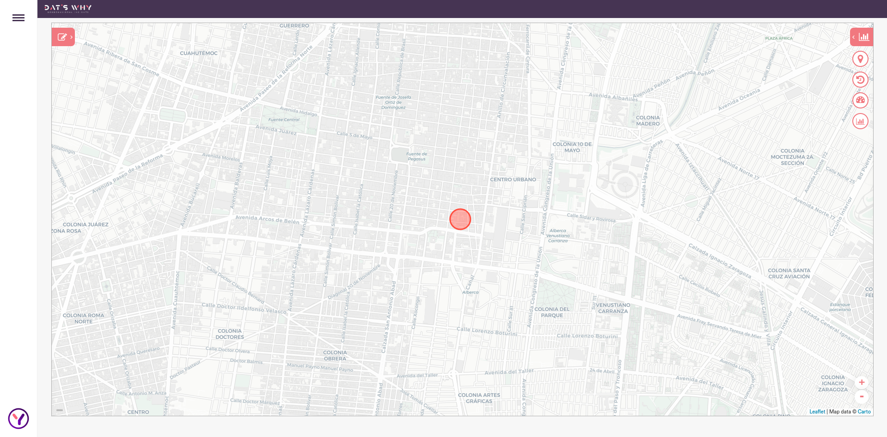

# Proyecto Frontend
Proyecto de prueba técnica para posición frontend-React

## Objetivo

Crear una interfaz de usuario de la imagen adjuntada utilizando principalmente *React*, *Mapbox* y *Material-UI*

## Instrucciones

1) Hacer Fork del repositorio de la prueba
2) Desarrollar el proyecto
3) Crear un pull request al repositorio del proyecto

## Requerimientos

1) Replicar la interfaz presentada en la imagen utilizando Rect teniendo en cuenta 3 componentes principales
    - Mapa (Usando Mapbox)
    - Panel lateral dentro del mapa
    - Menú desplegable fuera del mapa
2) En el caso del mapa agregar un marker actualizable al momento de hacer click en el mapa
3) Utilizar Material UI para el estilo de la interfaz recreada

## Entregables

Se tomará el pull request del fork del repositorio como entregable de la prueba con un tiempo máximo de 3 días a partir del envío de la prueba 

Se tomará en cuenta la estructura de la interfaz, para poder mostrar la experiencia trabajando con los componentes de React así como las buenas prácticas y el desarrollo de interfaces.

## Recursos

[Mapbox-gl](https://docs.mapbox.com/help/tutorials/use-mapbox-gl-js-with-react/)
[Material UI](https://mui.com/)

